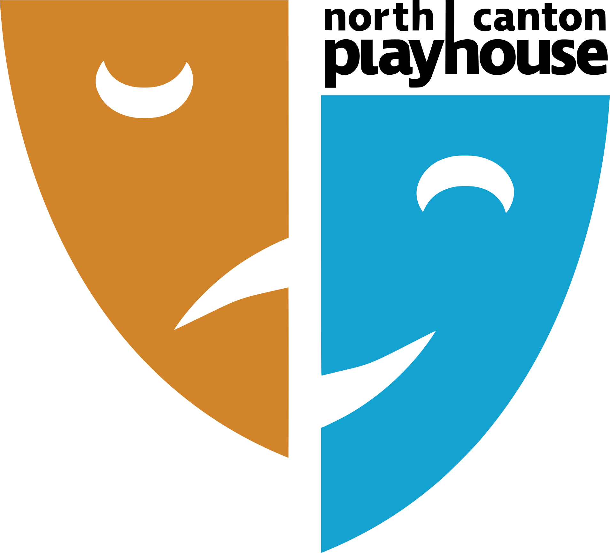

<h1 align="center">The Great NCP Program Riddle</h1>

<p align="center">A game NCP-goers can play while waiting for their show to start</p>

<div align="center">
  <a href="https://github.com/c-o-l-i-n/ncp-program-riddle/actions/workflows/deploy.yml">
    
  </a>
  <a href="https://ncp.rocks">
    
  </a>
  <a href="LICENSE">
    
  </a>
  <a href="https://standardjs.com">
    
  </a>
</div>

<br />

<p align="center">
  <a href="https://www.northcantonplayhouse.com/">
    
  </a>
</p>

## About

The [North Canton Playhouse](https://www.northcantonplayhouse.com/) is a community theater in North Canton, Ohio. This web application is a game audience members can play while waiting for their show to start.

Players find a page in the program with 8 QR codes. 7 lead to a [Rickroll](https://www.youtube.com/watch?v=uHgt8giw1LY), and 1 leads to Step 2 of the game. The correct QR code changes daily. Players then answer a series of riddle-like questions to win a "prize" at the end.

[Click here](https://ncp.rocks/complete?step=0) to enter the application, bypassing the Rickrolls.

### Technology Stack

[](https://nextjs.org/)
[](https://www.typescriptlang.org/)
[](https://pages.cloudflare.com/)

## Getting Started

### Prerequisites

- [Git](https://git-scm.com/)
- [Node.js](https://nodejs.org/) v14.6.0 or higher

### Install

```sh
git clone https://github.com/c-o-l-i-n/ncp-program-riddle.git
cd ncp-program-riddle
npm install
```

### Run

```sh
npm run dev
```

## Author

<a href="https://github.com/c-o-l-i-n">
  
</a>

**Colin A. Williams**

Website: [colinaw.com](https://colinaw.com)
<br>
Github: [@c-o-l-i-n](https://github.com/c-o-l-i-n)

<a href="https://www.buymeacoffee.com/colinw"></a>

## Contributing

Contributions, issues, and feature requests are welcome!<br />Feel free to check the [issues page](https://github.com/c-o-l-i-n/ncp-program-riddle/issues).

## License

Copyright © 2023 [Colin A. Williams](https://github.com/c-o-l-i-n).<br /> This project is [MIT](LICENSE) licensed.
